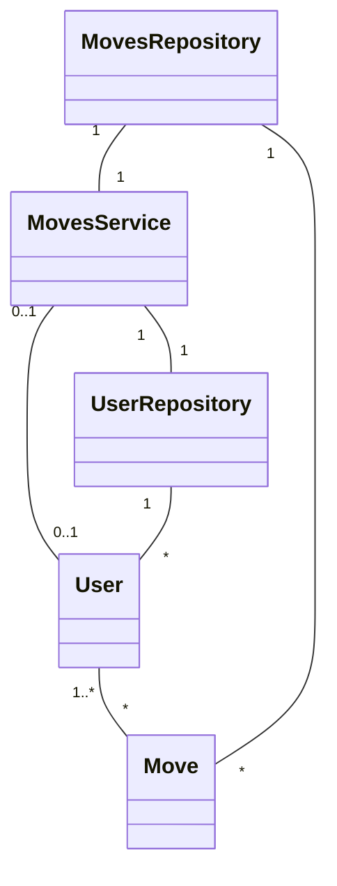
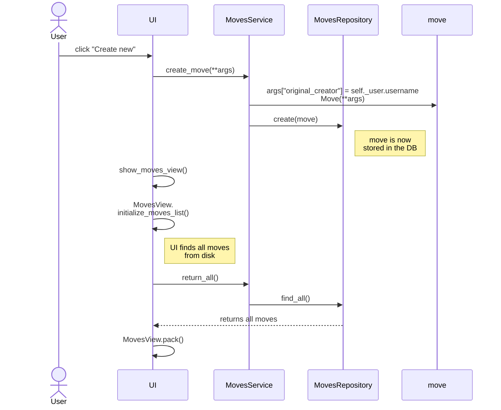

## Sovelluksen rakenne

Tällä hetkellä yhteen liikkeeseen liittyy vain yksi käyttäjä, mutta myöhemmin kaikki käyttäjät pystyisivät muokkaamaan mitä tahansa liikkeitä. Tällöin liike voisi tallentaa tiedon siitä, kuka on muokannut liikettä ja milloin.

### Päivitys (viikko 5)

Liikkeeseen tallennetaan [(str:päivämäärä,str:käyttäjä),..] muodossa muokkaushistoria, mutta varsinainen liikkeen ohjelmakoodi ei käytä User-luokkaa, vaan muokkaushistoria on pelkästään tekstiä.

## Toiminnallisuus / liikkeen luominen 

