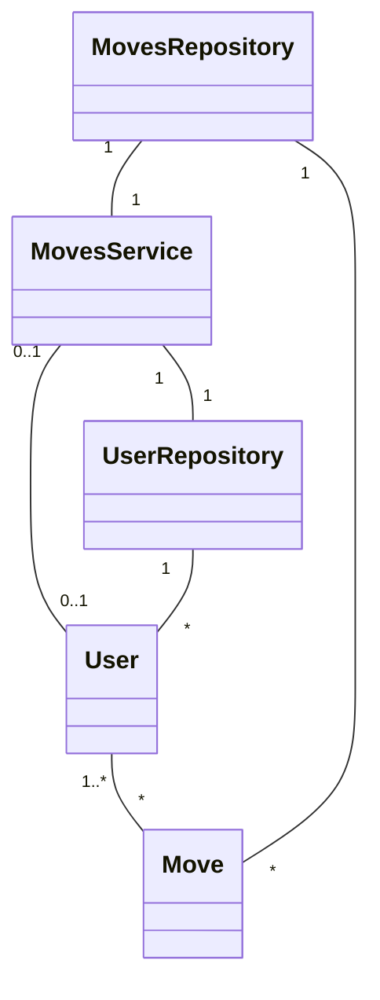
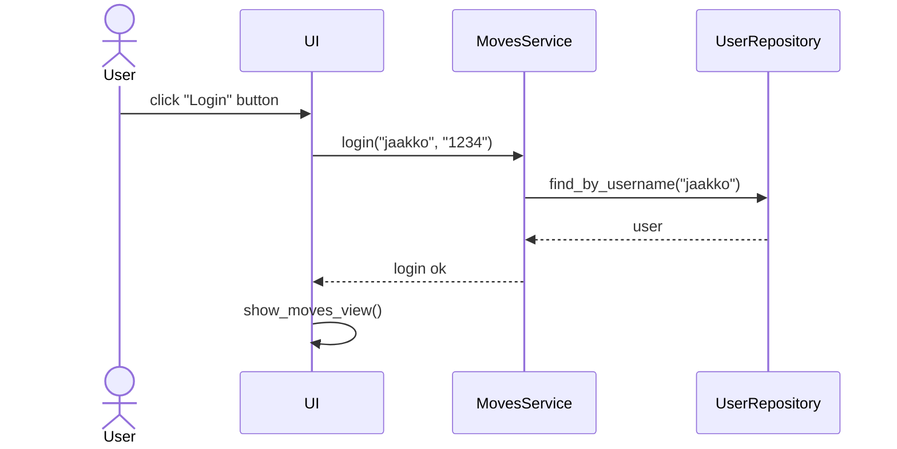
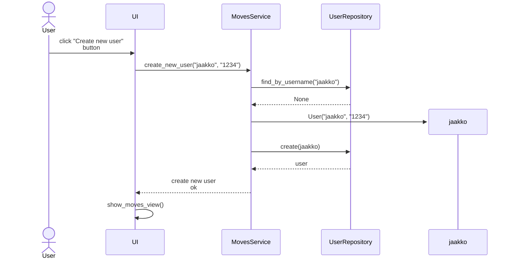
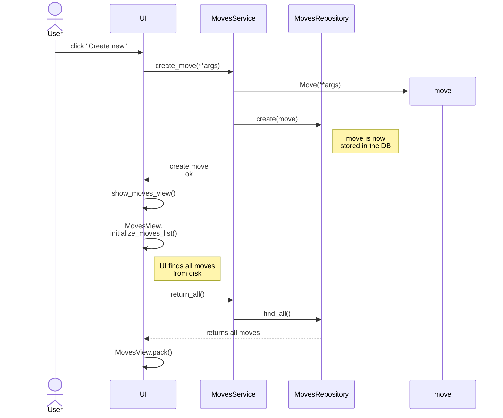
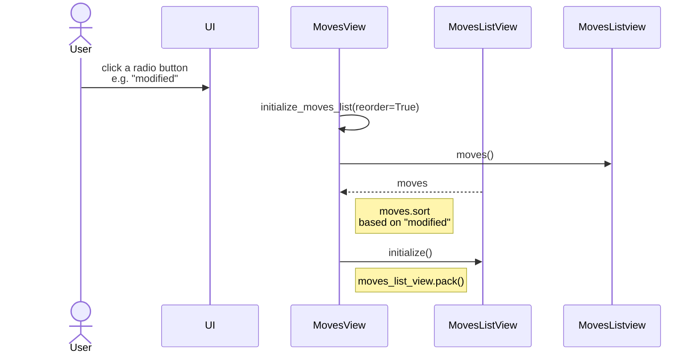

## Pakkausrakenne


- UI: käyttöliittymän toiminnallisuus
- services: sovelluslogiikka
- repositories: tietojen tallennus paikallisesti levylle 
- entities: tietokohteet (Move, User)
- caput (ulkoinen paketti): tietojen tallennus yaml-muodossa (ruamel.yaml)
- requests (ulkoinen paketti): kuvien lataaminen verkosta
- pillow (ulkoinen paketti): kuvien esittäminen ja käsittely (ei merkitty diagrammiin)

Services käyttää suoraan luokkaa User silloin kun uusi käyttäjä luodaan service metodilla `create_new_user`. Services käyttää myös luokkaa Move mutta välillä myös **args joka sisältää liikkeen tiedot. Myös UI käyttää Move-luokkaa (ei merkitty kuvaan) silloin kun liike halutaan poistaa `delete_move(move)` mutta tämän voisi yhtä hyvin korvata service metodilla `delete_move(move_id)`. Vastaavasti UI käyttää service metodia `get_logged_in_user()` joka voisi palauttaa pelkästään merkkijonon mutta se palauttaa User-olion.

Caput paketti antaa tiedostoille erikseen sisällön ja metadatan, mutta en toteuttanut ohjelmaan erikseen sisältöön liittyviä toimintoja, joten caput paketin sijaan olisin voinut käyttää pelkästään yaml-pakettia joka tallentaa objektit yaml-muodossa. Caput paketin idea on siinä että tallennettavat tiedostot avataan jollakin 3rd party markdown-editorilla. Yaml-paketin idea on luultavasti samankaltainen, eli idea on tallentaa data niin että se on helposti luettavissa joko ihmisen toimesta tai muuten. Näin ollen yaml on hieman eri asia kuin json.

Requests paketti helpottaa www-kyselyjen tekemistä huomattavasti ja ymmärtääkseni se on hyvin suosittu python-paketti.

## Käyttöliittymä
Käyttöliittymä sisältää useita eri näkymiä:
- päänäkymä joka listaa kaikki liikkeet
- kirjautumisen näkymä
- uuden käyttäjän luominen
- liikkeen näkymä
- liikkeen muokkaamisen näkymä
- liikkeen luomisen näkymä

Käyttöliittymä noudattaa samaa perusrakennetta referenssisovelluksen kanssa, eli kun käyttäjä avaa yhden näkymän, niin vanha näkymä piilotetaan ja näytetään uusi näkymä. Näkymien vaihdon hallinnoinnin toteuttaa UI-luokka, ja tämä käsittelee näkymiä `pack` ja `destroy` metodien kautta.

Käyttöliittymän koodi sisältää jonkin verran oleellisia toiminnallisuuksia, kuten kuvien lataaminen `requests` paketin avulla, ja liikkeiden järjestyksen muuttaminen. En ole vielä perehtynyt ohjelmointiin niin paljon että tietäisin miten nämä ominaisuudet tulisi organisoida ohjelmakoodissa.

Jokaista näkymää vastaa oma luokka. Liikkeen luominen ja muokkaus on periytetty abstract-luokasta, joka toteuttaa valtaosan molempien luokkien toiminnallisuudesta.

Päänäkymän järjestäminen on toteuttu niin että järjestyksen valitseminen kutsuu näkymän `initialize_moves_list` metodia. Tätä metodia käytetään myös silloin kun näkymä luodaan ensimmäisen kerran.

## Sovelluslogiikka



Sovelluksen perusidea on että Move-objekteja voi tarkastella kuka tahansa käyttäjä tai kirjautumaton käyttäjä. En tehnyt sovelluksesta tietokantapainotteista, joten teknisesti Move-objektit sisältävät vain string-arvoja ilman muuta kontekstia. MovesServicen ja muiden luokkien suhteet ovat merkitty oikein ja vastaa referenssisovellusta. 

Kuten aiemmin mainitsin, niin UI:n koodi sisältää seuraavat toiminnot:
- kuvan lataaminen verkosta `_load_image_from_url`
- liikkeiden järjestäminen valinnan perusteella `initialize_moves_list`

Jos katson esimerkiksi referenssisovelluksen `TodoRepository` tai `TodoService` luokkaa, niin ne eivät säilytä muistissa listaa Todo-objekteista. Sen sijaan `TodoListview` säilyttää listan Todo-objekteista. Näin ollen referenssisovelluksen perusteella listan järjestäminen olisi luontevaa toteuttaa käyttöliittymän puolella. Oma koodi toteuttaa järjestämisen käyttöliittymän puolella.

Kuvan lataamisen ja liikkeiden järjestämisen lisäksi on seuraavat päätoiminnot (MovesService):
- `create_move(**args)`
- `edit_move(**args)`
- `return_all()`: lue ja palauta levyltä kaikki liikkeet
- `find_by_uid(uid)`: etsi ja palauta levyltä haluttu liike
- `delete_move(move)`: poista liike levyltä
- `create_new_user(username, password)`
- `login(username, password)`
- `logout()`

Liikkeen muokkaushistorian tarkastelu on tavallaan yksi erikoistoiminto, mutta se on toteuttu suoraan liikkeen tietojen tarkasteluun, eli kun käyttäjä hakee liikkeen tiedot kutsumalla `find_by_uid` niin näkymä näyttää omalla erillisellä koodilla liikkeen muokkaushistorian modifications-kentän perusteella. Ohjelma ei tallenna omaa tietokantataulua muokkauksista.

Muokkaushistoria tallennetaan muodossa [(str:päivämäärä,str:käyttäjä),..] Move-luokan attribuuttiin modifications. Move-luokka ei käytä User-luokan koodia mitenkään, vaan käyttäjänimen tallennus on string-muodossa. Yaml-paketti onnistuu lukemaan ja tallentamaan muokkaushistorian helposti.

Kuten referenssisovelluksessa niin MovesService käyttää MovesRepository ja UserRepository luokkia yllämainituissa toiminnoissa. Näiden toteutus on täysin riippumatonta service-luokasta, ja service-luokka saa toteutukset konstruktorissa (sama idea kuin referenssisovelluksessa).

## Tietojen pysyväistallennus

Liikkeiden tallennuksesta huolehtii MovesRepository ja se tallentaa liikkeet caput paketin avulla yaml-muodossa. Käyttöohjeen lopussa on annettu esimerkki miltä nämä tallennetut tiedostot näyttävät käytännössä. Kuten refererenssisovelluksessa, niin testeissä on hyödynnetty omaa MovesRepository-toteutusta. Liikkeiden tallennuksen kansion nimi on vaihdettavissa .env tiedoston kautta. Oletuksena on nimi `my-moves` ja sovellus luo tämän kansion kerran käynnistyksen yhteydessä (jos ei ole jo luotu). Jos kansio poistetaan sovelluksen käynnissäolon aikana, niin sovellus ei osaa reagoida tähän. Yksi tiedosto on aina yksi liike ja tiedoston nimi on muodossa `uid.md`. Muoto `uid.md` helpottaa liikkeiden käsittelyä hieman, koska silloin ohjelmaan ei tarvitse tallentaa erikseen tietoa liikkeen tiedostopolusta, vaan se löytyy uid:n avulla. Niin ikään uid helpottaa asioita paljon kun tiedostoilla on aina eri nimet.

Käyttäjien tallennus on tehty ohjelman monipuolisuuden vuoksi SQLite:n avulla. Tämä toiminnallisuus on täysin sama referenssisovelluksen kanssa. Siinä käytetään users-taulua ja seuraavaa schemaa:

```txt
CREATE TABLE Users (
            name text,
            team text,
            username text primary key,
            password text
        );
```

Tiedoston .env avulla sqliten käyttämä tiedostonimi on vaihdettavissa. Oletuksena on nimi `database.sqlite`. En toteuttanut ohjelmaan toimintoja jotka hyödyntävät users-taulun name ja team kenttiä.

## Toiminnallisuudet

### Käyttäjän kirjautuminen

Kirjautuminen on toteuttu referenssisovelluksen tavoin. Sovellus käynnistyy moves-näkymään, minkä jälkeen käyttäjä painaa painiketta "Login/Create account". Sen jälkeen avautuu kirjautumisnäkymä. Kirjautumisnäkymän Login-painikkeen painaminen on kuvattu seuraavassa:



Painike käynnistää LoginView-näkymän metodin `login_handler` joka toteuttaa kirjautumisen MovesServicen avulla. Service-luokka hakee UserRepositoryn avulla käyttäjän annetun käyttäjänimen perusteella. Jos UserRepository palauttaa `None`, niin silloin service luokka palauttaa käyttöliittymälle virheen `InvalidCredentialsError`. Sama virhe palautetaan myös jos salasana on väärin. Kun kirjautuminen onnistuu, niin silloin käyttöliittymän näkymäksi vaihtuu moves-näkymä, jonne on ilmestynyt teksti "logged in as jaakko" ja painikkeet "Logout", "Create new".

### Uuden käyttäjän luominen

Uuden käyttäjän luominen on toteutettu referessinsovelluksen tavoin. Uuden käyttäjän luominen onnistuu kirjautumisnäkymästä painamalla "Create account". Sitten avautuu uuden käyttäjän luomisen näkymä, jossa on painike "Create new user". Seuraavassa on kuvattu "Create new user" painikkeen toiminta.



Painike käynnistää CreateUserView-näkymän metodin `create_user_handler` joka toteuttaa uuden käyttäjän luomisen MovesService-luokan avulla. Service-luokka hakee UserRepositoryn avulla käyttäjän annetun käyttäjänimen perusteella. Jos UserRepository palauttaa löydetyn käyttäjän, niin service-luokka palauttaa käyttöliittymälle virheen `UsernameExistsError`. Jos virhettä ei palauteta, niin silloin service-luokka luo User-olion (diagrammissa jaakko) ja tallentaa käyttäjän UserRepositoryn metodilla `create(jaakko)`. Tässä ei varsinaisesti tule esiin, miksi service-luokka luo User-olion, mutta `create_new_user` asettaa kirjautuneeksi käyttäjäksi tämän User-olion. Lopuksi näytetään moves-näkymä.

### Liikkeen luominen

Liikkeen luominen tapahtuu päänäkymästä valitsemalla "Create new". Käyttäjän pitää olla ensin kirjautunut, jotta tämä painike on näkyvissä. Tämän jälkeen avautuu CreateMoveView-näkymä jossa on painikkeet "Back" ja "Create". Seuraavassa on kuvattu "Create" painikkeen toiminto.



Painike käynnistää näkymän metodin `form_action_handler` joka käyttää MovesService-luokkaa liikkeen luomisessa. MovesService voi palauttaa virheet `MoveNameIsEmptyError` tai `TooShortMoveNameError`, jos liikkeen luominen ei onnistu. UI lisää parametreihin luontipäivän ja käyttäjän, ja kutsuu sitten MovesServicen metodia create_move(**args). MovesService luo liikkeen MovesRepositoryn avulla. Seuraavaksi tapahtuu liikkeiden näyttäminen, joka ei ole räätälöity liikkeen lisäämistä varten, vaan uusimmat liikkeet haetaan levyltä samalla tavoin kuten sovelluksen käynnistyksessä.

### Liikkeiden järjestäminen

Liikkeiden järjestäminen on moves-näkymän yksi toiminto. Liikkeiden järjestäminen tapahtuu pelkästään käyttöliittymän kahden luokan yhteistoiminnalla. Nämä ovat MovesView ja MovesListView. MovesListView sisällyttää attribuuttina liikkeet joita MovesView pystyy käsittelemään. Järjestämisen tapauksessa MovesView pyytää nämä liikkeet ja kutsuu sitten listan metodia `sort` sopivalla `key` parametrilla. Listan metodi `sort` on tässä tapauksessa sopiva, koska MovesListView säilyttää viittauksen samaan listaan. Lopuksi MovesListView kutsuu uudestaan metodia `initialize` jota kutsuttiin siis myös silloin kun lista näytettiin ensimmäisen kerran. Olen toteuttanut järjestämisen niin että se käynnistyy kutsulla `initialize_moves_list(reorder=True)` jolloin tässä tapauksessa listaa ei haeta levyltä uudestaan.


