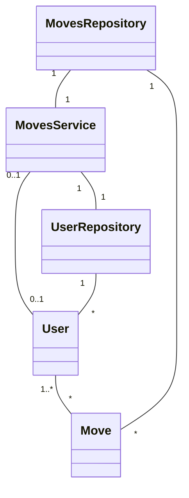

Tällä hetkellä yhteen liikkeeseen liittyy vain yksi käyttäjä, mutta myöhemmin kaikki käyttäjät pystyisivät muokkaamaan mitä tahansa liikkeitä. Tällöin liike voisi tallentaa tiedon siitä, kuka on muokannut liikettä ja milloin.