# Käyttöohje

Lataa projektin koodi [releases](https://github.com/maggaou/ot-harjoitustyo/releases)-sivulta.

## Konfigurointi

Tallennukseen käytettävien tiedoston ja hakemiston nimeä voi halutessaan konfiguroida käynnistyshakemiston _.env_-tiedostossa:

```
MOVES_DIRECTORY_NAME=my-moves
DATABASE_FILENAME=database.sqlite
```

Tallennettavat liikkeet tallennetaan oletuksena _my-moves_ kansioon.

## Ohjelman käynnistys

1. riippuvuuksien asennus `poetry install`
2. virtuaaliympäristön aktivointi `eval $(poetry env activate)`
3. tietokannan alustus `invoke build`
4. käynnistys `invoke start`

## Päänäkymä

Sovellus käynnistyy moves-näkymään, jossa näytetään kaikki luodut liikkeet:

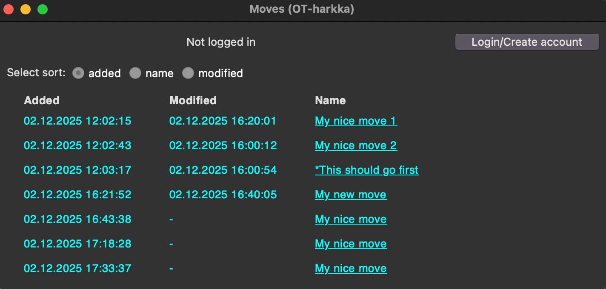

Jos järjestelmässä on käytössä tumma teema, niin ikkunan tausta on tumma kuten kuvassa. Päänäkymässä pystyy järjestämään liikkeet lisäyksen, nimen tai muokkauksen perusteella. Kun käyttäjä on kirjautunut, niin päänäkymän kautta pystyy luomaan uusia liikkeitä.

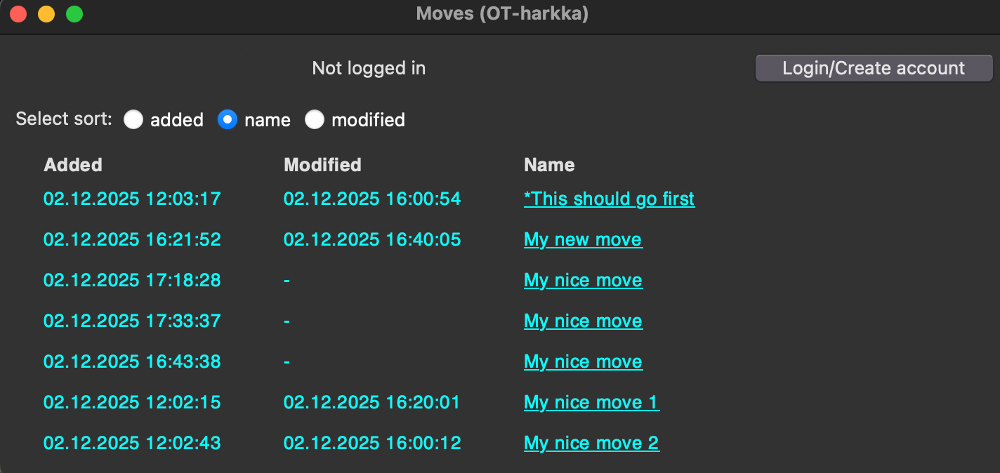
↑ Järjestäminen nimen perusteella.

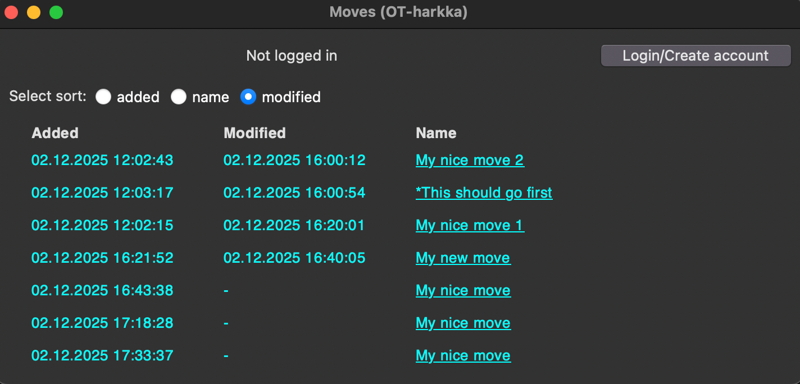
↑ Järjestäminen muokkauksen perusteella.

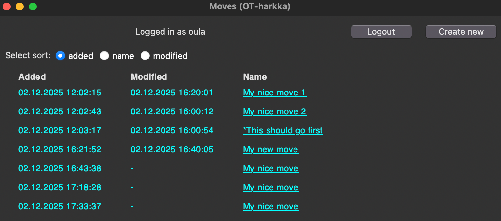
↑ Kun käyttäjä on kirjautunut, niin ilmestyy Create new-painike.
&nbsp;

Painamalla alleviivattua liikkeen nimeä avautuu liikkeen näkymä.

## Kirjautuminen
Valitse päänäkymästä Login/Create account. Syötä käyttäjätunnus ja salasana ja paina login. Kirjautumisnäkymästä pääsee takaisin päänäkymään painamalla Show moves.

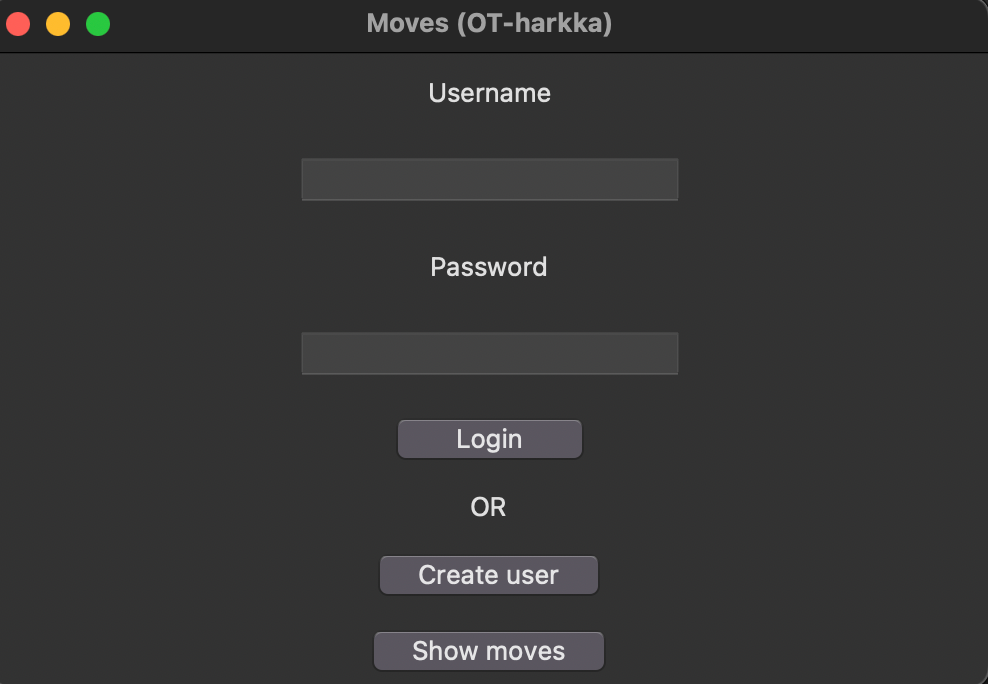

## Uuden käyttäjän luominen
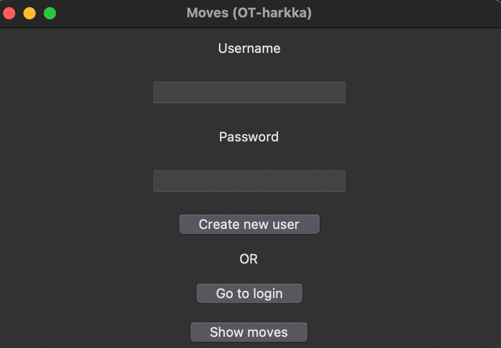

Valitse kirjautumisnäkymästä Create user. Syötä haluttu käyttäjätunnus/salasana ja paina Create new user. Uuden käyttäjän luomisen näkymästä on mahdollista navigoida takaisin kirjautumisen näkymään (Go to login) tai päänäkymään (Show moves)

## Liikkeen näkymä
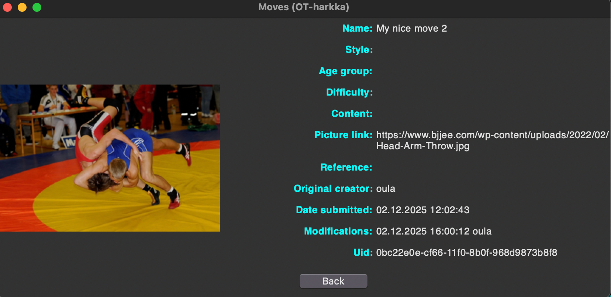
↑ Esimerkki liikkeen näkymästä.

&nbsp;

Liikkeen näkymässä näytetään liikkeen kaikki tiedot ja sen kuva. Kuva haetaan picture link kentän perusteella. Liikkeen näkymästä pääsee takaisin päänäkymään (back). Lisäksi liikkeen näkymästä on mahdollista poistaa liike tai muokata sitä (jos käyttäjä on kirjautunut).

&nbsp;

Jos liikkeen kuvan linkki ei ole toimiva, niin näkymä raportoi tästä:
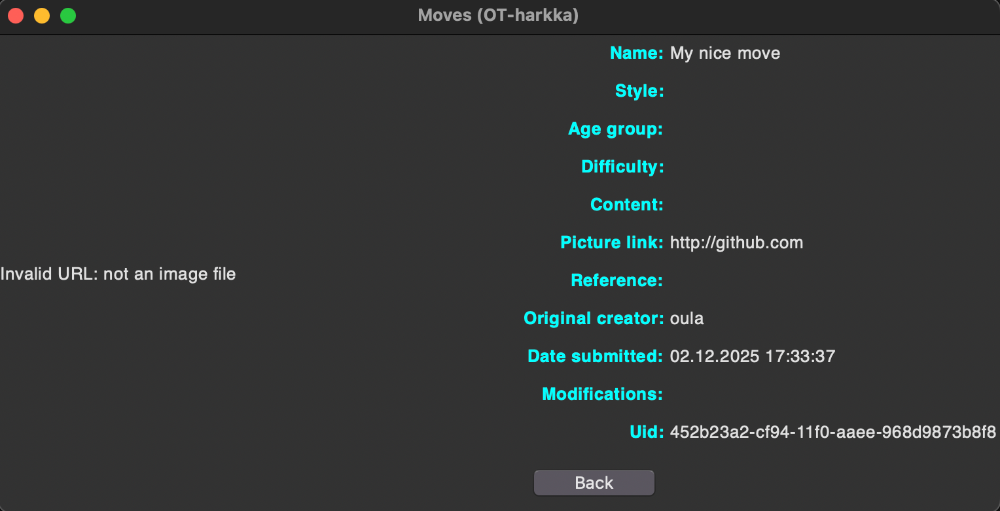

&nbsp;

Jos liikettä on muokattu useita kertoja, niin kaikki muokkaukset näkyvät liikkeen näkymässä:
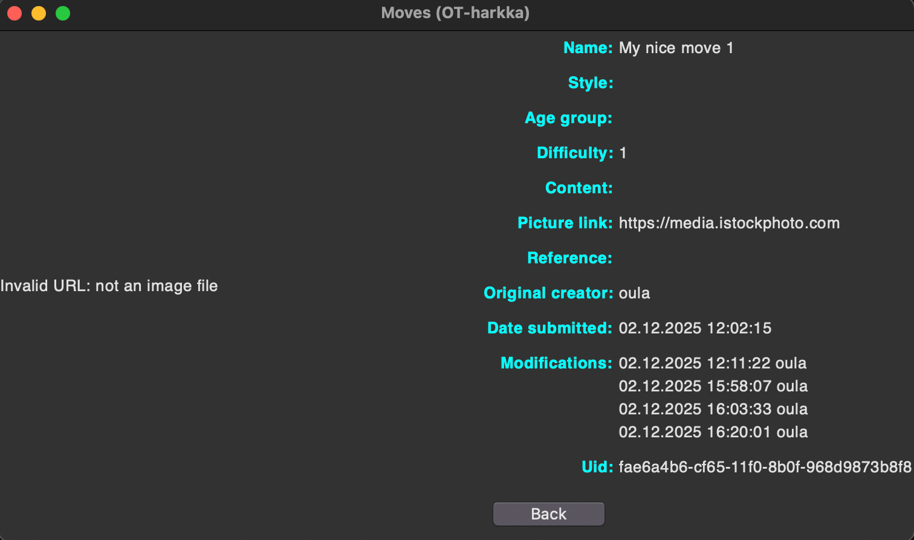

&nbsp;

Jos käyttäjä on kirjautunut, niin liikkeen näkymässä näkyy Delete ja Edit napit:


&nbsp;

Kirjautuneen käyttäjän omat muokkaukset on alleviivattu:
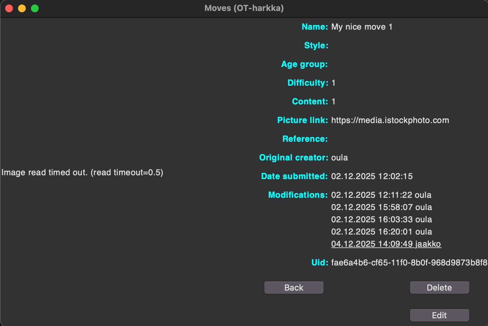

&nbsp;

Seuraavassa osuudessa kuvataan liikkeen muokkaamisen näkymä (edit).

## Liikkeen muokkaaminen
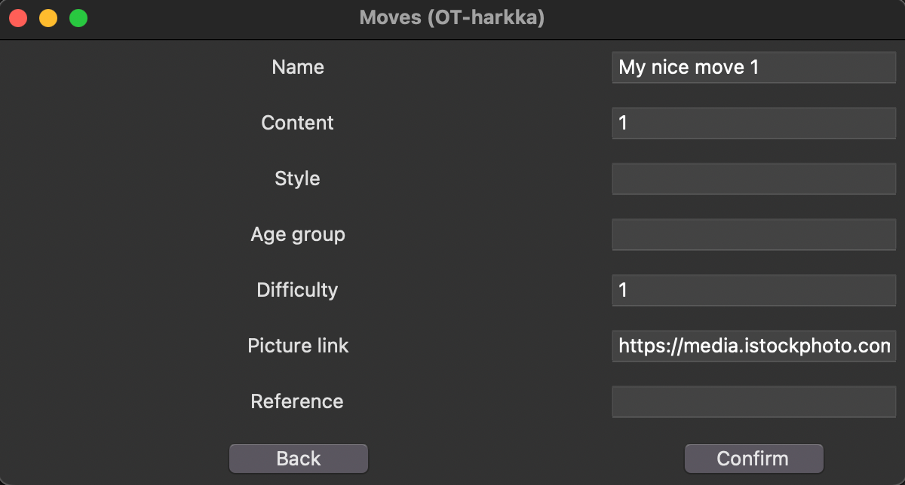


Liikkeen muokkauksessa liikkeen aikaisemmat tiedot ovat esitäytetty.

&nbsp;

Liikkeen nimen täytyy olla tarpeeksi pitkä ja muut kentät voivat olla tyhjiä:
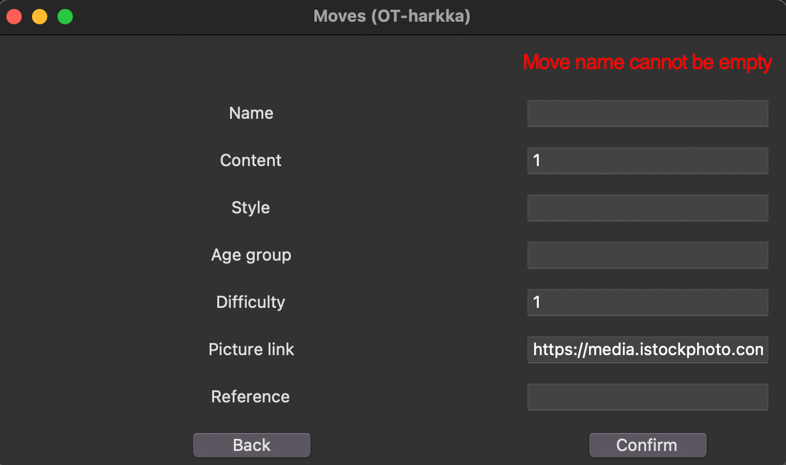

&nbsp;

Liian lyhyt nimi:
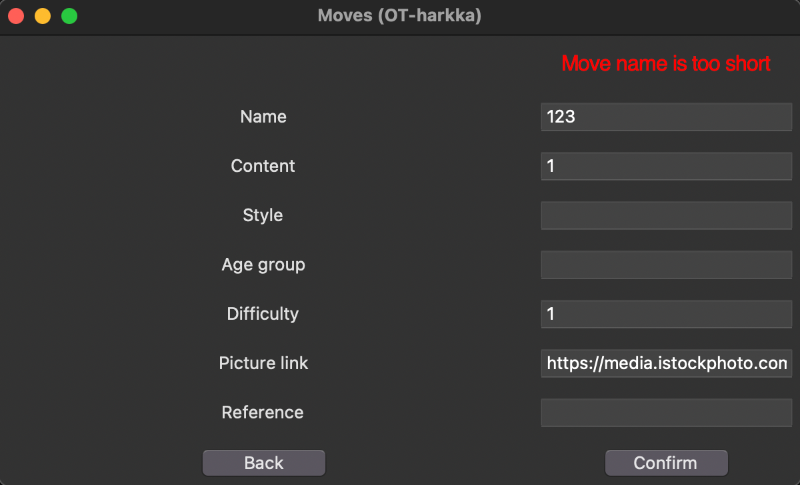

&nbsp;

Linkin oikeellisuus tarkistetaan ja käy ilmi vasta liikkeen näkymässä. Lomaketiedoista poistetaan aina ylimääräiset välilyönnit alusta/lopusta. Muokkaus joka ei muuta mitään aiheuttaa virheviestin "Nothing has changed". Back-nappi palaa takaisin liikkeen näkymään.

## Liikkeen luominen
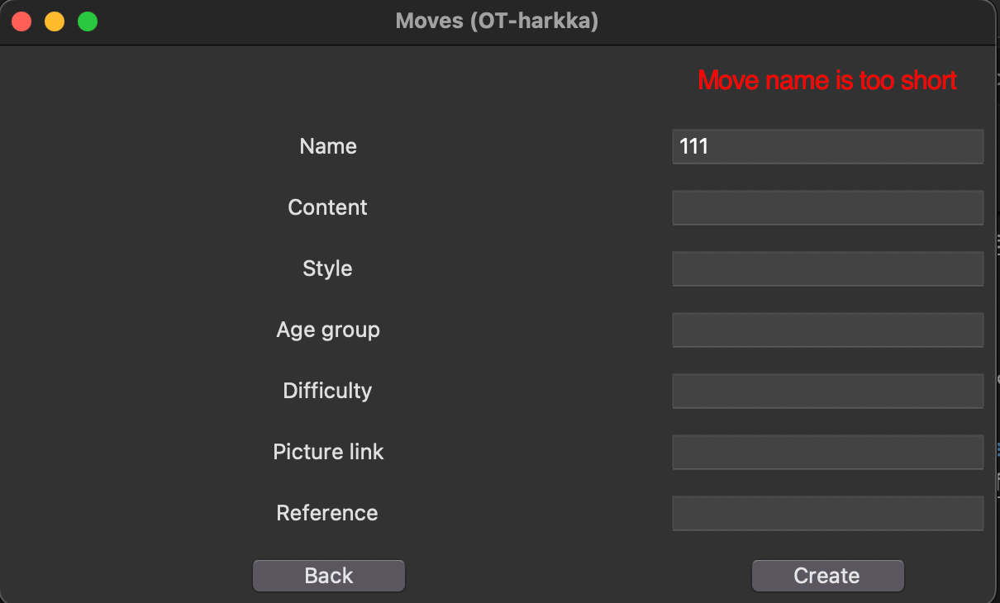

Liikkeen luominen tapahtuu päänäkymästä painamalla "Create new" painiketta. Liikkeen luominen onnistuu sitten kun käyttäjä on kirjautunut. Liikkeen luomisessa on käytössä samat virheet kuin liikkeen muokkauksessa, pois lukien "nothing has changed".

&nbsp;

Liikkeen luomisessa voi käyttää nimeä "my move" ja voit kokeilla luoda liikkeet näillä linkeillä:

- https://www.bjjee.com/wp-content/uploads/2022/02/Head-Arm-Throw.jpg
- https://i.ytimg.com/vi/lBRACHYmQ48/maxresdefault.jpg
- https://media.istockphoto.com/id/1498741574/photo/firemans-carry-throw-practice-by-heavyweight-wrestlers-in-gym.jpg?s=1024x1024&w=is&k=20&c=pizCS6ndjhrDkDqTHB3TDtGLpZhcKgUK1bygI9EbeWg=

&nbsp;

Lisäksi voit kokeilla luoda jonkun liikkeen linkillä https://github.com jne. Syötä linkit picture link kenttään.

## Luotujen liikkeiden tarkastelu ohjelman ulkopuolella

Luodut liikkeet tallennetaan tekstitiedostoina data/my-moves kansioon. Voit tulostaa luodut liikkeet komennolla:

```
cat data/my-moves/*.md
```

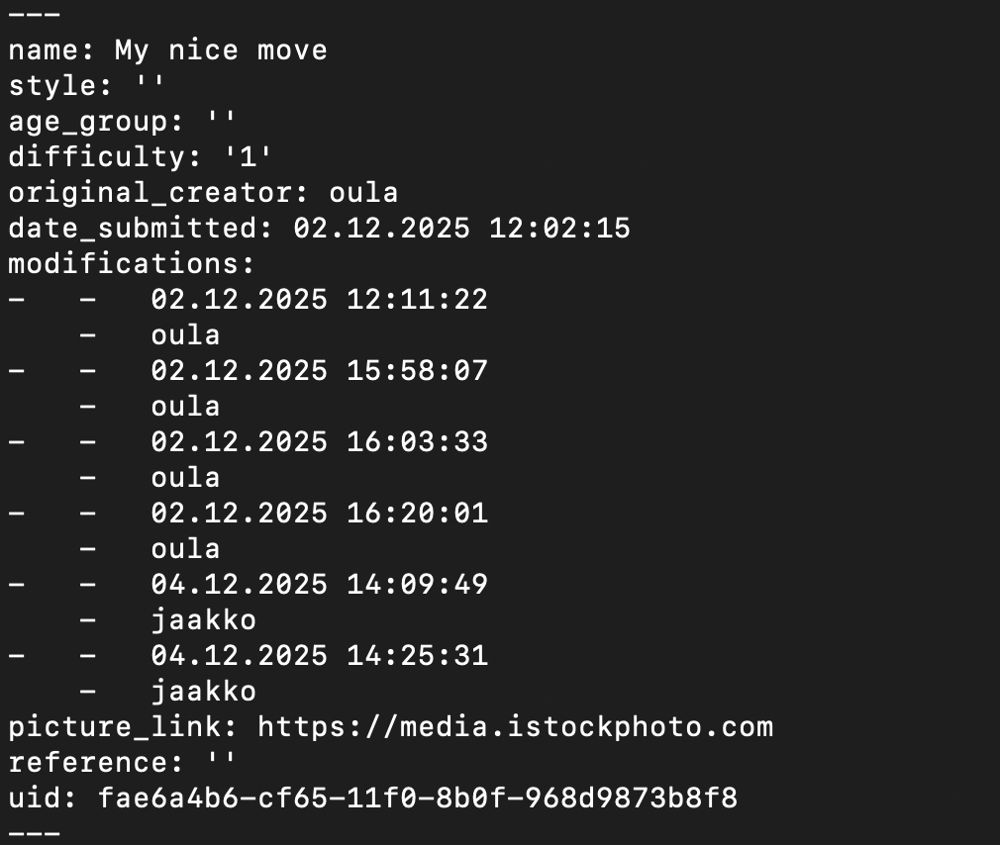
