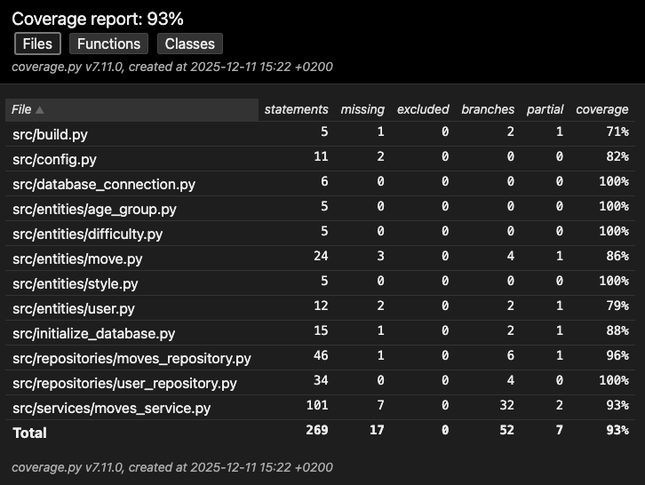
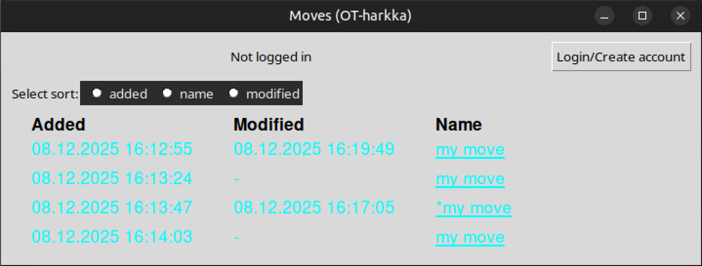

# Testausdokumentti

Testausdokumentin rakenne:
- yksikkö- ja integraatiotestaus
- järjestelmätestaus
- sovellukseen jääneet laatuongelmat

## Yksikkö ja integraatiotestaus
### Sovelluslogiikka
Sovelluslogiikka `MovesService` on testattu refenssisovelluksen tavoin luokalla `TestMovesService` joka tallentaa tiedot `FakeMovesRepository` ja `FakeUserRepository` avulla RAM-muistiin. Tällä tavoin sovelluslogiikan testaus ei ole riippuvaista todellisten repository-luokkien toiminnasta. Repository-luokat testataan sitten erikseen omilla testeillä.

### Repository-luokat
Repository-luokat ovat siis `MovesRepository` ja `UserRepository` joita testataan luokilla `TestMovesRepository` ja `TestUserRepository`. Testeille on määritelty erikseen oma tiedosto/kansio `.env.test` tiedoston avulla.

### Testikattavuus
Sovelluksen testauksen haarautumakattavuus on 93%. Tämä ei sisällä siis itse testejä tai käyttöliittymän koodia. Kuten referenssisovelluksessa, niin testeihin on sisällytetty turhaan `build.py` ja `initialize_database.py`. Myös `config.py` on turha.

MovesRepositoryn osalta ei testata kansion luomista jos sitä ei ole. MovesServicen osalta ei testata liikkeen muokkausta normaalissa tilanteessa (ainoastaan virhetilanteissa). Myös `delete_move` ja `find_by_uid` jäivät testaamatta servicen osalta (niiden toiminta on kuitenkin suoraan repositoryn vastaava toiminnallisuus). Raportissa on myös muita "missing" rivejä joita en tässä käy tarkemmin läpi.

## Järjestelmätestaus
### Asennus ja konfigurointi
Sovellusta on kokeiltu [käyttöohjeen](./kayttoohje.md) perusteella macilla ja linuxilla. Myös eri konfiguraatiotilanteita on kokeiltu (eri nimet `DATABASE_FILENAME` tai `MOVES_DIRECTORY_NAME` ja onko moves-kansio olemassa vai ei). Jos moves-kansio on olemassa, niin sovellus hakee sieltä kaikki liikkeet, ja jos sitä ei ole niin semmoinen luodaan. Tämän kansion tarkastus tehdään ainoastaan alussa.

### Toiminnallisuudet
Olen testannut käyttöliittymässä [vaatimusmäärittelyn](./vaatimusmaarittely.md) kuvaamat toiminnot. Olen testannut toimintoja macilla ja linuxilla. Käyttäjän ja liikkeen lisäämisessä/muokkauksessa olen kokeillut eri virhetilanteita. Kuvan lataaminen ei aina onnistu lyhyen aikarajan takia, mutta muuten kaiken pitäisi toimia.

## Sovellukseen jääneet laatuongelmat

### Päänäkymä
Linuxilla päänäkymän radio-nappien väritys on virheellinen, ja tästä johtuen radio-nappi ei näytä että se on valittu/ei-valittu. Valinnan tekeminen onnistuu kuitenkin myös linuxilla normaalisti. 

Lisäksi linuxilla päänäkymän taustaväri on vaalea, vaikka linuxin asetuksista olisi asetettu tumma teema päälle. Tätä ongelmaa ei ole macilla, vaan macilla tausta vaihtuu automaattisesti tumman ja vaalean välillä. Turkoosi teksti on valittu macin tummalle teemalle, ja luonnollisesti se ei näy mielekkäästi vaalean taustan kanssa.

### Muuta

- ei virheilmoitusta jos konfiguraation kansioon/tiedostoon ei ole luku/kirjoitusoikeutta
- ei virheilmoitusta jos tietokantaa ei ole alustettu ts. ei ole suoritettu komentoa `invoke build`
- ei virheilmoitusta jos käyttäjä poistaa moves-kansion sovelluksen ollessa käynnissä
- ei virheilmoitusta jos käyttäjä poistaa tietokannan sovelluksen ollessa käynnissä
- ei virheilmoitusta jos move-tiedostojen luku ei onnistu (esim. formaatti on virheellinen)