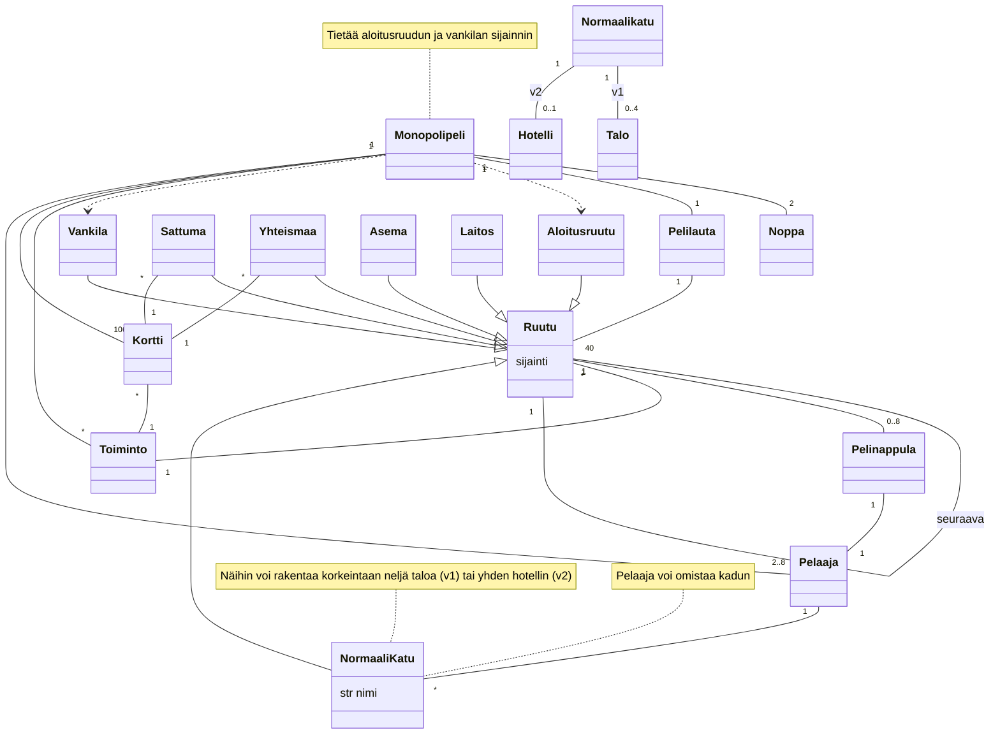

```mermaid
 classDiagram
    %% tehtävässä valmiiksi
    Monopolipeli "1" -- "2" Noppa
    Monopolipeli "1" -- "1" Pelilauta
    Pelilauta "1" -- "40" Ruutu
    Ruutu "1" -- "1" Ruutu : seuraava
    Ruutu "1" -- "0..8" Pelinappula
    Pelinappula "1" -- "1" Pelaaja
    Pelaaja "2..8" -- "1" Monopolipeli
    %% oma toteutus:
    Aloitusruutu --|> Ruutu
    Vankila --|> Ruutu
    Sattuma --|> Ruutu
    Yhteismaa --|> Ruutu
    Asema --|> Ruutu
    Laitos --|> Ruutu
    NormaaliKatu --|> Ruutu
    NormaaliKatu : str nimi
    Ruutu : sijainti
    Monopolipeli ..> Aloitusruutu
    Monopolipeli ..> Vankila
    note for Monopolipeli "Tietää aloitusruudun ja vankilan sijainnin"
    Ruutu "*" -- "1" Toiminto
    Monopolipeli "1" -- "*" Toiminto
    Monopolipeli "1" -- "106" Kortti
    Kortti "*" -- "1" Toiminto
    Sattuma "*" -- "1" Kortti
    Yhteismaa "*" -- "1" Kortti
    Normaalikatu "1" -- "0..4" Talo : v1
    Normaalikatu "1" -- "0..1" Hotelli : v2
    note for NormaaliKatu "Näihin voi rakentaa korkeintaan neljä taloa (v1) tai yhden hotellin (v2)"
    Pelaaja "1" -- "*" NormaaliKatu
    note for NormaaliKatu "Pelaaja voi omistaa kadun"
```