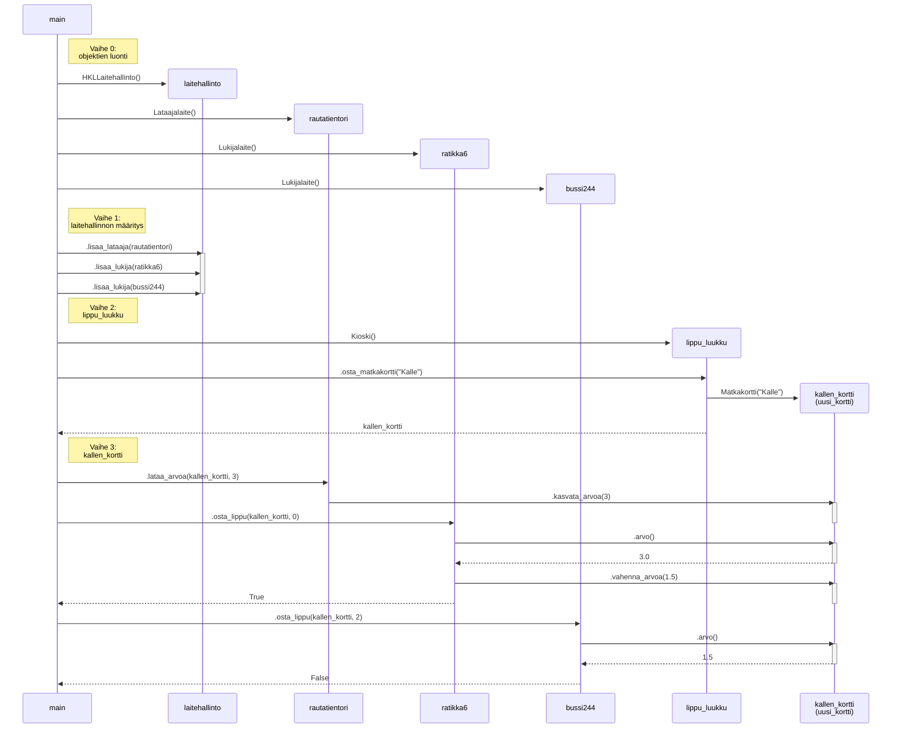

```mermaid
sequenceDiagram
    participant M as main
    note right of M: Vaihe 0:<br/>objektien luonti
    create participant LH as laitehallinto
    M->>LH: HKLLaitehallinto()
    create participant rauta as rautatientori
    M->>rauta: Lataajalaite()
    create participant 6 as ratikka6
    M->>6: Lukijalaite()
    create participant 244 as bussi244
    M->>244: Lukijalaite()
    note right of M: Vaihe 1:<br/>laitehallinnon määritys
    M->>LH: .lisaa_lataaja(rautatientori)
    activate LH
    M->>LH: .lisaa_lukija(ratikka6)
    M->>LH: .lisaa_lukija(bussi244)
    deactivate LH
    note right of M: Vaihe 2:<br/>lippu_luukku
    create participant ll as lippu_luukku
    M->>ll: Kioski()
    M->>ll: .osta_matkakortti("Kalle")
    create participant k as kallen_kortti<br/>(uusi_kortti)
    ll->>k: Matkakortti("Kalle")
    ll-->>M: kallen_kortti
    note right of M: Vaihe 3:<br/>kallen_kortti
    M->>rauta: .lataa_arvoa(kallen_kortti, 3)
    rauta->>k: .kasvata_arvoa(3)
    activate k
    M->>6: .osta_lippu(kallen_kortti, 0)
    deactivate k
    6->>k: .arvo()
    activate k
    k-->>6: 3.0
    deactivate k
    6->>k: .vahenna_arvoa(1.5)
    activate k
    6-->>M: True
    deactivate k
    M->>244: .osta_lippu(kallen_kortti, 2)
    244->>k: .arvo()
    activate k
    k-->>244: 1.5
    deactivate k
    244-->>M: False
```